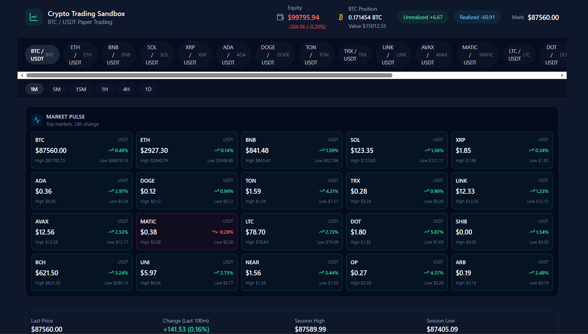
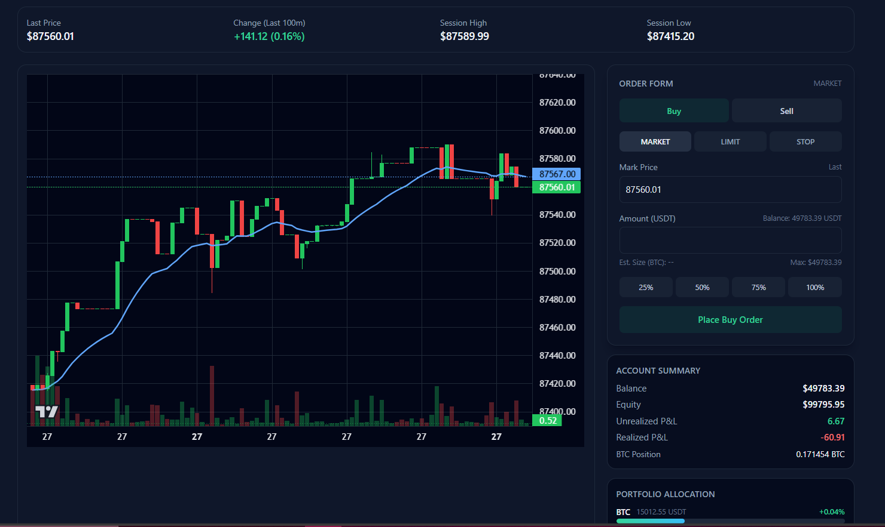
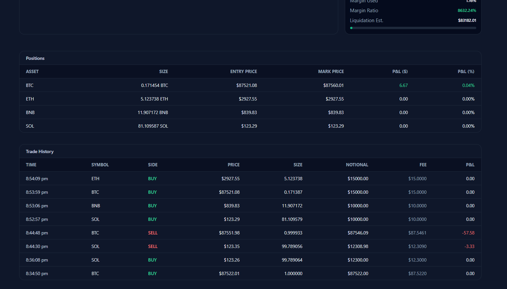

# 🚀Crypto Sandbox: Crypto trading Simulator

**Crypto Sandbox** is a cryptocurrency trading simulator. It bridges the gap between theory and the high-stakes reality of live markets by providing a **zero-risk, high-consequence** environment.

---

## 🚀 Getting Started

### Prerequisites
- Node.js v16 or higher
- npm or yarn

### Installation

1. **Clone the repository**

        git clone git@github.com:SP652/CryptoSandBoX.git
        cd cryptosandbox

2. **Install dependencies**

        npm install

3. **Start the development server**

        npm run dev

---

## 📷 Snapshots

---

### ⚠️ Disclaimer
Simulation only. No real trading or financial advice.
